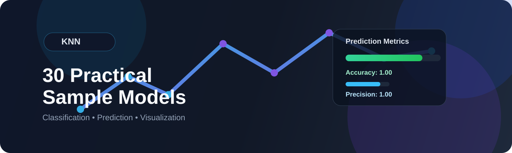
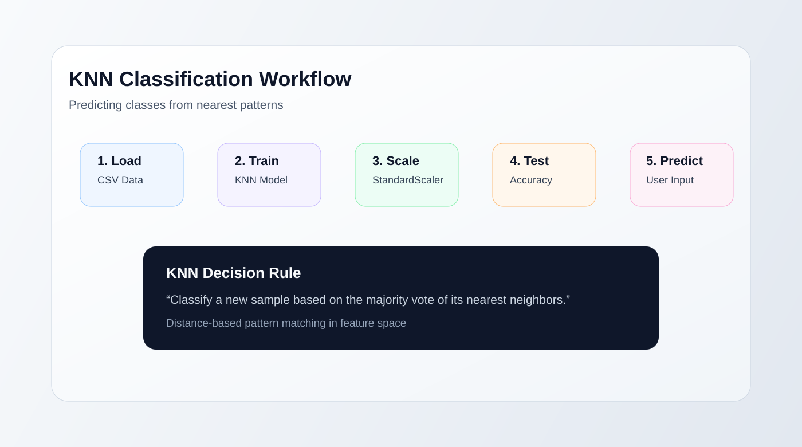
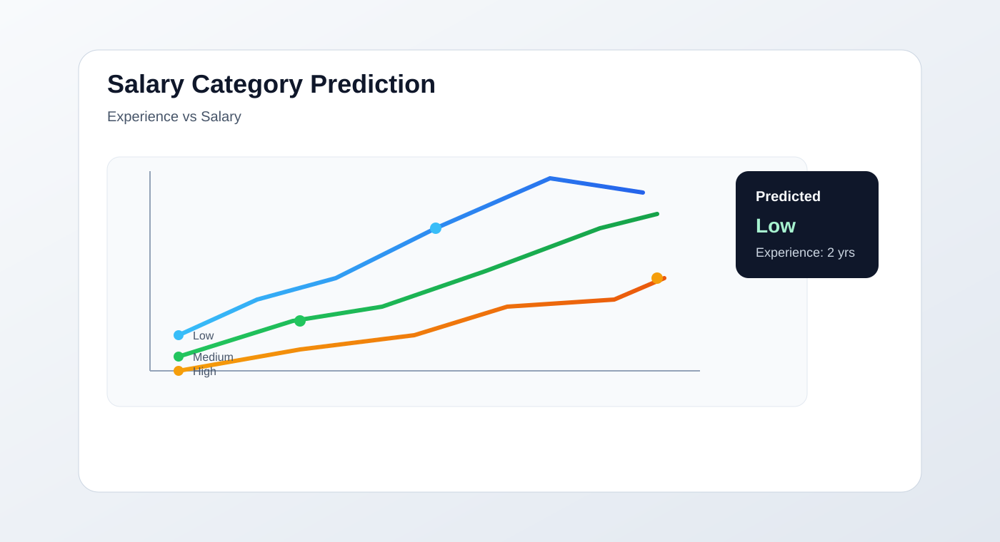

# KNN 30 Practical Sample

<p align="center">
  
</p>

<p align="center">
  <a href="https://github.com/sgsinghashka-del/-KNN-30-Practical-Sample"></a>
  <a href="https://scikit-learn.org/"></a>
  <a href="https://jupyter.org/"></a>
  <a href="https://matplotlib.org/"></a>
</p>

A compact, hands-on learning project that demonstrates the power of the K-Nearest Neighbors (KNN) algorithm across 9 practical classification use cases. The notebook is designed for beginners and learners who want to see KNN in action with both code and visual interpretation.

## Overview

This repository contains a single Jupyter notebook, `KNN_30_Practical_Sample_IPYNB.ipynb`, which walks through a series of beginner-friendly classification problems. Each section follows a standard machine learning flow:

- Load small dataset
- Select features and target
- Split training and testing data
- Scale features when needed
- Train KNN classifier
- Evaluate prediction accuracy
- Accept user input and predict class
- Visualize the result using charts

The project uses `sklearn.neighbors.KNeighborsClassifier` with `n_neighbors=3`, a straightforward configuration that makes the examples easy to understand.

## Why this project matters

KNN is one of the simplest and most intuitive machine learning algorithms:

- It does not assume a linear decision boundary
- It works well for small, tabular datasets
- It is easy to explain and visualize
- It is a strong first model for classification learning

This notebook turns theory into practice by applying KNN to real-world-inspired scenarios like finance, healthcare, marketing, education, and customer analytics.

## Dataset coverage: 9 practical KNN use cases

| # | Use Case | Features | Prediction Target |
|---|---|---|---|
| 1 | Salary Category Prediction | Experience, Salary | Low / Medium / High |
| 2 | Employee Promotion Prediction | Experience, Performance | Yes / No |
| 3 | Student Result Prediction | Study Hours, Attendance | Pass / Fail |
| 4 | Loan Approval System | Income, Credit Score | Yes / No |
| 5 | Credit Card Fraud Detection | Amount, Time | Fraud / Not Fraud |
| 6 | Medical Diagnosis | Sugar, BP | Diabetes / No Diabetes |
| 7 | Customer Churn Prediction | Years, Usage | Churn / Not Churn |
| 8 | Email Spam Detection | Number of Links | Spam / Not Spam |
| 9 | Movie Recommendation | Rating | Recommend / Not Recommend |

### Detailed analysis of each example

1. Salary Category Prediction
   - Uses experience and salary to classify salary ranges.
   - Helpful for understanding how KNN separates categories in a 2D feature space.

2. Employee Promotion Prediction
   - Combines years of experience and performance score.
   - Illustrates how strategic decisions can be approximated through nearest-neighbor similarity.

3. Student Result Prediction
   - Uses study hours and attendance.
   - Demonstrates how educational indicators can support predictive outcomes.

4. Loan Approval System
   - Evaluates income and credit score.
   - One of the clearest examples of classification used in financial systems.

5. Credit Card Fraud Detection
   - Uses transaction amount and time.
   - Shows how anomaly-like decisions can be framed as binary classification.

6. Medical Diagnosis
   - Predicts diabetes risk using sugar level and blood pressure.
   - Highlights the importance of careful model validation in health applications.

7. Customer Churn Prediction
   - Maps years of service and usage pattern to likely churn.
   - Useful for customer retention analysis.

8. Email Spam Detection
   - Uses number of links as a feature.
   - A simple, intuitive classification task that demonstrates lightweight feature engineering.

9. Movie Recommendation
   - Uses movie rating to recommend or not recommend.
   - Shows how even a single-feature KNN system can emulate simple recommendation logic.

## Tech stack

- Python
- Pandas
- NumPy
- scikit-learn
- Matplotlib
- Jupyter Notebook

## Machine learning workflow in the notebook

<p align="center">
  
</p>

The notebook generally follows this process:

1. Import required libraries
2. Load dataset from CSV
3. Select feature columns and target column
4. Split into training and testing sets
5. Apply dataset scaling (`StandardScaler`) when necessary
6. Train `KNeighborsClassifier(n_neighbors=3)`
7. Predict against the test set
8. Print accuracy, confusion matrix, and classification report
9. Ask user for custom input and generate prediction
10. Plot a chart to visualize the result

## Typical output style

The notebook includes:

- Accuracy score
- Classification report
- Confusion matrix
- User prompt for input
- Predicted class label
- Graphical plots for data visualization

<p align="center">
  
</p>

## Notes on data and results

This project is intentionally educational and uses small synthetic datasets. As a result, metrics often show perfect accuracy (e.g., `1.0`) because the toy datasets are very simple and highly separable.

This is a strength for learning, but it also means the notebook should be understood as a demonstration of KNN principles rather than a production-ready predictive system.

## How to run it

1. Clone the repository:

```bash
git clone https://github.com/sgsinghashka-del/-KNN-30-Practical-Sample.git
cd -KNN-30-Practical-Sample
```

2. Open the notebook in Jupyter:

```bash
jupyter notebook KNN_30_Practical_Sample_IPYNB.ipynb
```

3. Run the cells in order.

## Project structure

```text
.
├── KNN_30_Practical_Sample_IPYNB.ipynb
├── assets/
│   ├── knn-banner.svg
│   ├── knn-pipeline.svg
│   └── knn-salary-preview.svg
└── README.md
```

## Screenshot gallery

<p align="center">
  
</p>

<p align="center">
  
</p>

<p align="center">
  
</p>

## Learning takeaway

This notebook is a great beginner-level introduction to:

- supervised classification
- feature selection
- data scaling
- train/test split
- prediction evaluation
- visual interpretation of model behavior

If you are learning machine learning, this project is a strong way to understand how a classic algorithm behaves across multiple everyday datasets.

## Future improvements

Potential enhancements for the project could include:

- adding a single consolidated dashboard
- testing different values of `k`
- comparing KNN with logistic regression and decision trees
- adding cross-validation
- saving trained models
- converting notebook code into a Python script

## License

No explicit license file is included in the repository. Please check the repository for licensing status before reusing the project in public or commercial contexts.

---

Made with Python, scikit-learn, and a lot of learning curiosity.

